# Android Emulator QA - 2026-09-28

## Ambiente

- AVD `Default`, Android 15 / API 35, Google Play x86_64 system image.
- APK debug compilado localmente e instalado com `adb`; não é o APK assinado de release.
- Nenhuma conta foi usada e nenhum formulário foi enviado.
- O PID do SaveMed não registrou `FATAL EXCEPTION` e `MainActivity` permaneceu em primeiro plano. Uma exceção separada ocorreu no utilitário Android `uiautomator` após dumps repetidos (`UiAutomationService ... already registered`); ela pertence à ferramenta de inspeção, não ao processo do app.

## Resultados

- Login inicial abriu no emulador em escala de fonte padrão.
- A escala nativa foi elevada temporariamente para 200%. Cabeçalho, campos,
  recuperação de senha, ações e formulário permaneceram legíveis; o conteúdo
  foi percorrido por rolagem até o rodapé, sem corte horizontal visível.
- O cadastro de cliente expõe campos rotulados e segue por rolagem vertical.
- O modo Farmácia diferencia visualmente `Nova farmácia` de `Solicitar acesso`.
  A solicitação existente informa que não pede senha antes da aprovação e
  descreve a busca por nome, cidade, CNPJ ou ID.
- O teclado nativo abriu no campo de busca em escala padrão, mantendo o campo
  visível. Em fonte a 200%, a captura e o teste de widget em 320 px confirmam
  que o hint curto `Nome ou CNPJ` cabe; a instrução preserva os outros critérios.
- Com fonte padrão, o teclado Android exibiu a ação Próximo no responsável, CNPJ,
  nome da farmácia e CEP. Acioná-la avançou do responsável para a etapa 2 e do
  CEP para Contato. O nome da farmácia recebeu foco após o CNPJ.
- O preenchimento automatizado por `adb input` na etapa Contato não foi confiável:
  perdeu caracteres ao digitar e acionou a validação de telefone. Não avançamos
  manualmente até senha no AVD; a progressão das quatro etapas, senha, confirmação
  e envio está coberta pelo teste de widget com ações IME e serviço fake.
- A inspeção encontrou o placeholder longo truncado em 200%. Ele foi encurtado
  após a captura `before`; a captura atual mostra o hint completo.
- Nenhuma busca foi enviada e nenhum dado de cadastro foi submetido.
- A escala foi restaurada a `1.0` ao final da verificação.
- Isso é um smoke test local do APK debug; não valida login real, API, cadastro,
  pagamentos, Play Store, aparelho físico nem leitor de tela.

## Capturas

- Login em escala padrão: 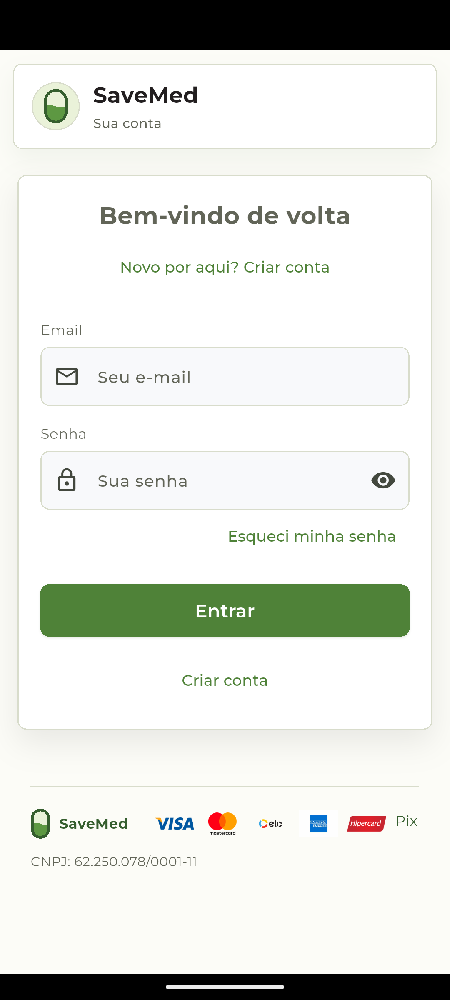
- Login e rodapé com fonte a 200% após rolagem: 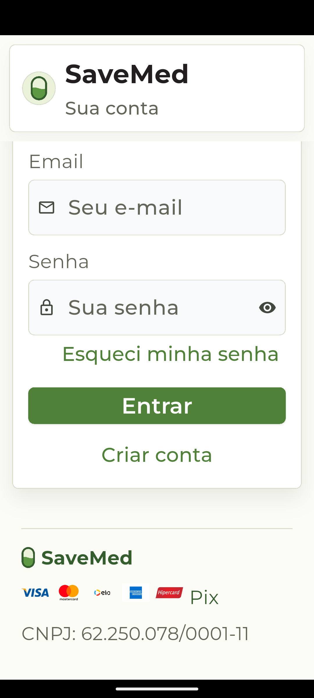
- Cadastro de cliente: 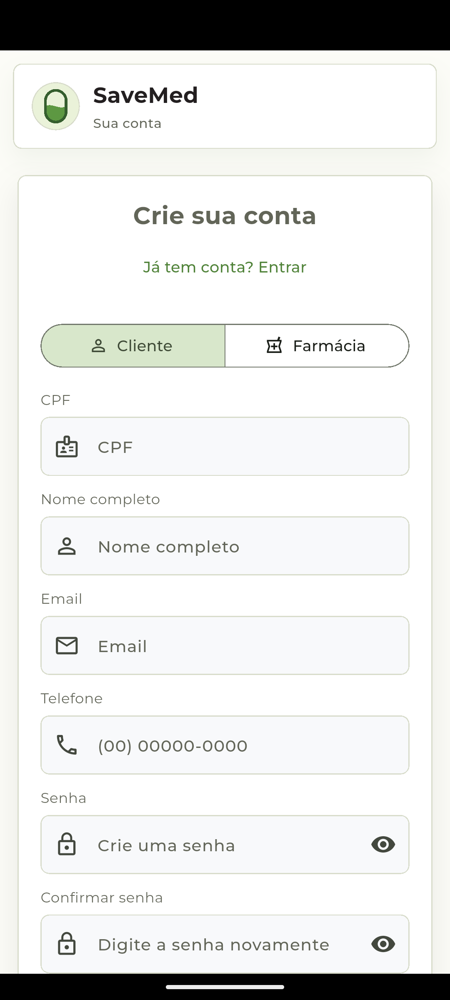
- Seleção de cadastro de farmácia: 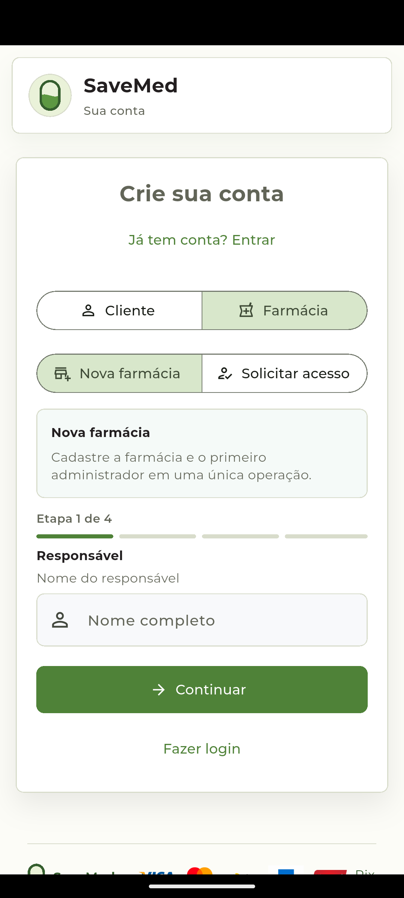
- Solicitação de acesso atual: 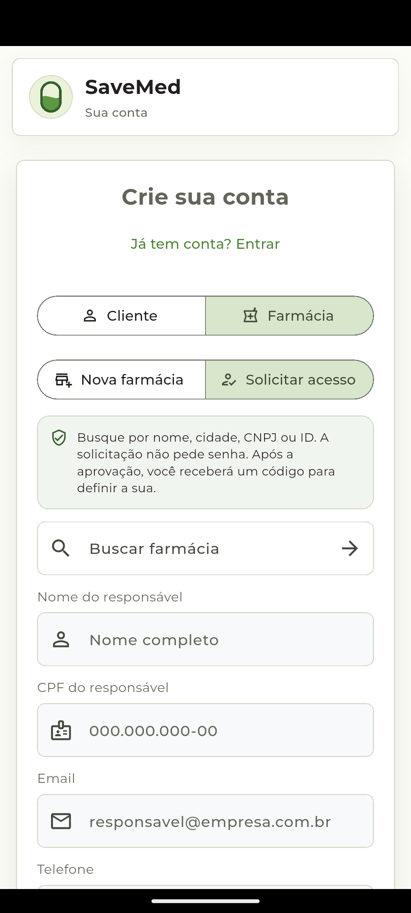
- Busca focada com teclado: 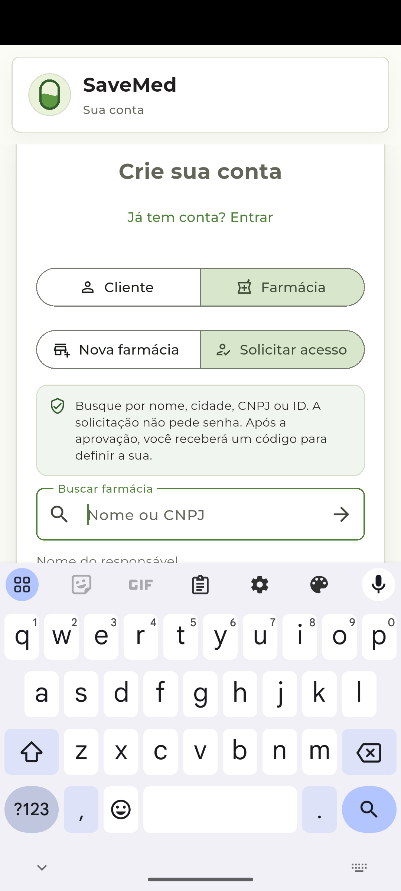
- CNPJ preenchido e nome da farmácia focado após Próximo: 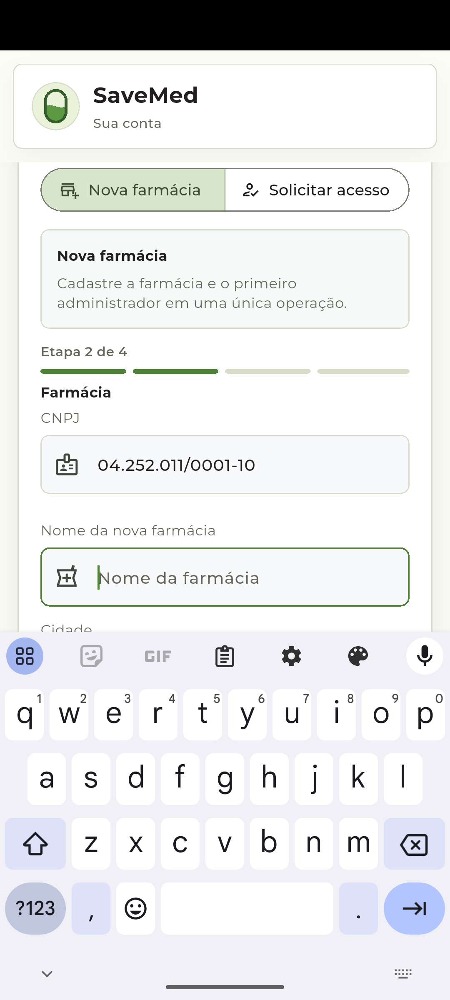
- Etapa Contato após Próximo no CEP: 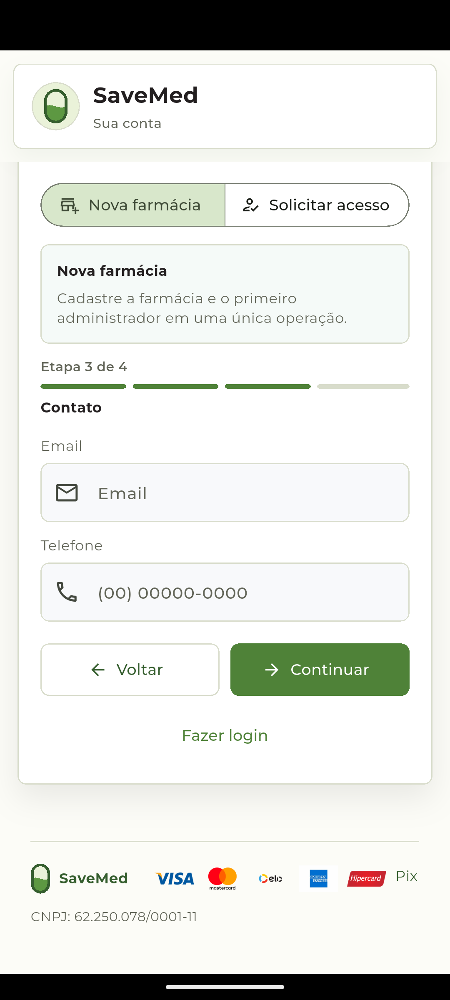
- Placeholder anterior truncado a 200%: 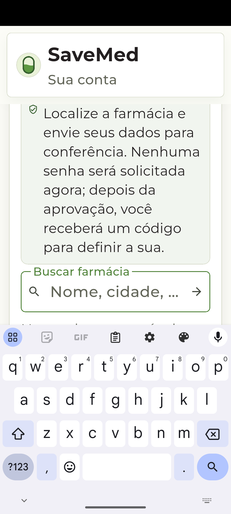
- Campo corrigido a 200%: 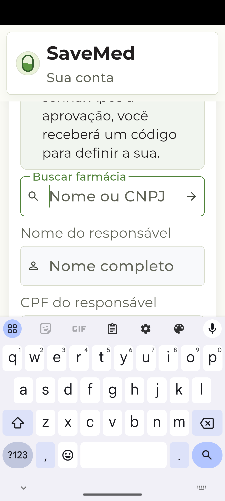

## Revalidacao do APK debug atual

Em 28/09/2026, o APK debug reconstruido apos a correcao semantica dos requisitos
de senha foi instalado no AVD `Default` (API 35) e aberto com sucesso. A
`MainActivity` permaneceu em primeiro plano e a tela de login foi exibida por
inteiro, sem erro fatal. Nenhuma conta foi usada e nenhuma requisicao de login
foi enviada. Esta verificacao confirma apenas instalacao e abertura do build
debug atual; o APK assinado, autenticacao real e distribuicao interna continuam
pendentes.

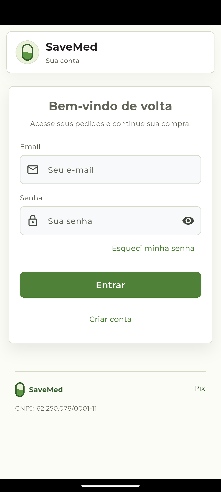

## Smoke do APK release assinado

Tambem em 28/09/2026, o APK release assinado foi instalado no AVD `Default`
(API 35) e aberto com sucesso. `MainActivity` permaneceu em primeiro plano,
nao houve `FATAL EXCEPTION` do SaveMed na janela de logs inspecionada, e a
captura mostra a tela inicial completa. Nenhuma conta foi usada e nenhuma
requisicao de autenticacao foi enviada. Isso valida instalacao e abertura local
do artefato release, mas nao login real, aparelho fisico nem distribuicao interna.

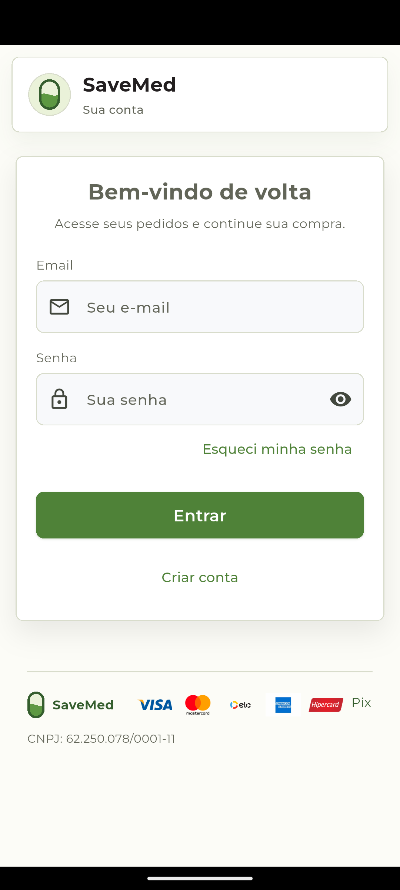

## Smoke do APK release anterior - 2026-10-02

O APK release reconstruído com o código atual foi instalado em um AVD novo e
isolado, `SaveMedReleaseQA` (Android 15 / API 35, Google Play x86_64). A tela de
login abriu, `MainActivity` permaneceu em primeiro plano e a inspeção do logcat
não encontrou erros `AndroidRuntime` ou `Flutter` fatais. A assinatura v2 foi
verificada com o mesmo certificado release já registrado acima.

Nenhuma conta foi usada, requisição de autenticação enviada ou dado gravado no
servidor. Isso cobre instalação e abertura do build local, não autenticação,
cadastro, pagamento, aparelho físico ou distribuição interna. O AVD `Default`,
que já continha o app de debug com certificado diferente, foi preservado sem
desinstalar o app nem seus dados.

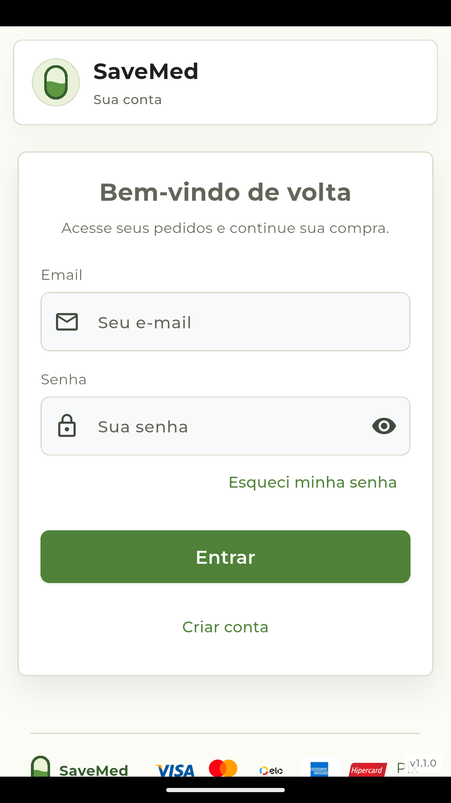

## Build release após validação do frete - 2026-10-02

Após rejeitar cotações de frete malformadas ou com preço negativo/não finito e
validar esse valor novamente antes da criação do pedido,
`flutter build apk --release` concluiu localmente. `apksigner` confirmou a
assinatura v2 no certificado release esperado; `aapt` confirmou
`com.bravelight.save_med`, versão `1.1.0`/código `7` e SDK alvo 36. O APK tem
57,1 MB e SHA-256
`1eb42bdbc4ff7140d93d6c6da6ed568fa6bca07f35a9d35df335f661446e0060`.

O build web release em `/savemed/` também concluiu. O APK atualizado não foi
instalado em emulador ou aparelho após essa mudança; não houve publicação nem
autenticação. A captura acima corresponde ao build anterior e só comprova a
abertura da tela de login daquela compilação.

## Rebuild após validação de valores não finitos - 2026-10-02

Depois de ajustar o parser compartilhado e os parsers de valores financeiros da
API para rejeitar `NaN` e `Infinity`, a análise estática passou e os 307 testes
Flutter seriais passaram. A auditoria OSV nao encontrou advisories conhecidos
nas 85 dependencias Pub hospedadas. O build web release foi gerado com base
`/savemed/`. APKs debug e release foram recompilados; `apksigner` confirmou
assinatura v2 e certificado release esperado, e `aapt` confirmou
`com.bravelight.save_med`, versão `1.1.0`/código `7` e SDK alvo 36. SHA-256 do
APK release: `e1412dd1435fae152b8e548ceb207b01b99c955e4ed2dfeed6bdc9da3282da16`.

Este APK não foi instalado em emulador ou aparelho após a alteração. Nenhuma
publicação, autenticação ou operação contra a API foi feita nesta verificação.
