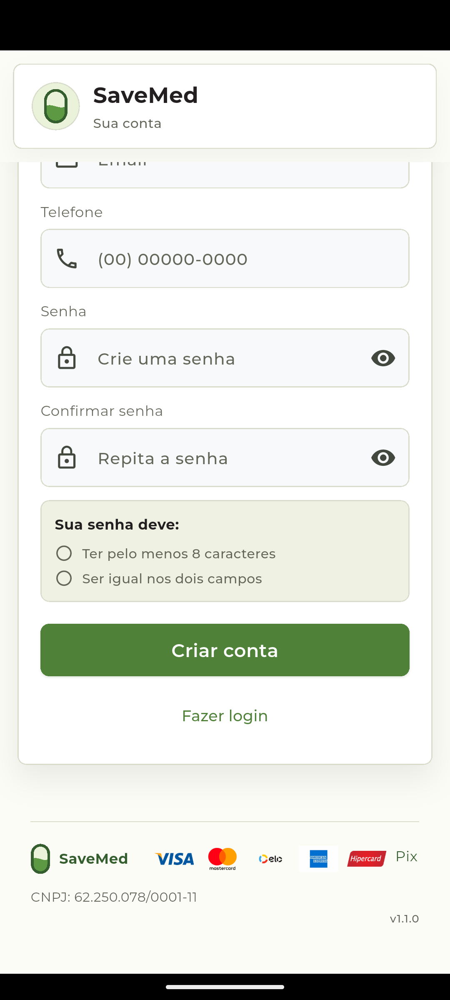

# Android QA - 2026-10-03

## Environment

- AVD `Default`, Android 15 (API 35), 1080x2400 at 420 dpi.
- Installed the current debug APK with `adb install -r`, preserving the existing app data.
- APK package/version: `com.bravelight.save_med`, `1.1.0` (version code 7).
- Manifest review found only the `INTERNET` permission; backup is disabled, cleartext traffic is not enabled, and the exported activity is the launcher entry point.

## Results

- The app opened on the login screen and the customer registration form opened.
- Scrolled to the password confirmation section. The version label `v1.1.0` previously floated over the confirmation field; it now lives in the normal `SaveMedFooter` scroll flow, outside the global app shell. The screenshot shows the field and label in separate areas.
- Focused the password field. The field remained visible and Gboard reported its keyboard view as shown, but the AVD screenshot rendered the keyboard area blank; physical keyboard visuals and text entry remain unverified.
- The app remained foregrounded; the inspected logcat window contained no `FATAL EXCEPTION` or Flutter error.
- No credentials were entered, no account was submitted, and no authenticated action was performed.
- The same no-overlap condition is covered by a widget regression at 390x844. The full Flutter suite passed 344 tests, `flutter analyze` passed, and Web release plus Android debug builds completed.

## Evidence

Web entrypoint generated by the validated release build: `main.6fd80cd39642b7f78c8244e55d42f3cff9e7b7be0bbc3ef3e0faae18c990104b.dart.js` (SHA-256 verified against its filename).

This emulator smoke test does not validate a real account, production API, physical devices, Play Store delivery, iOS, accessibility services, or payment flows.

## Current local candidate recheck

- The current local APK debug candidate has SHA-256 `E3609A52E961D7F9FFE1BB8B0EC223C199A5DC0776886B832B72FCFC6A0737C4` and keeps the published `1.1.0`/version code `7` identity.
- On the available AVD (Android 15/API 35), package `com.bravelight.save_med` is installed as version `1.1.0`, code `7`. Another application was in the foreground during this read-only check; the candidate was not installed or launched to avoid interrupting that session.
- The earlier APK smoke-test evidence above applies to its recorded build, not automatically to this latest local candidate. Revalidation of this candidate remains open.
