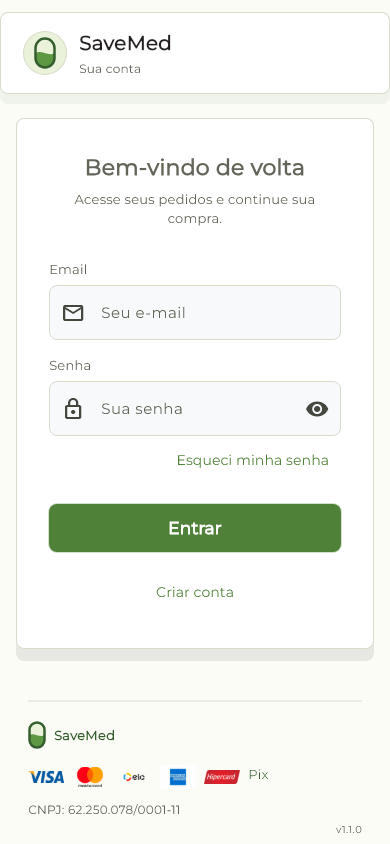
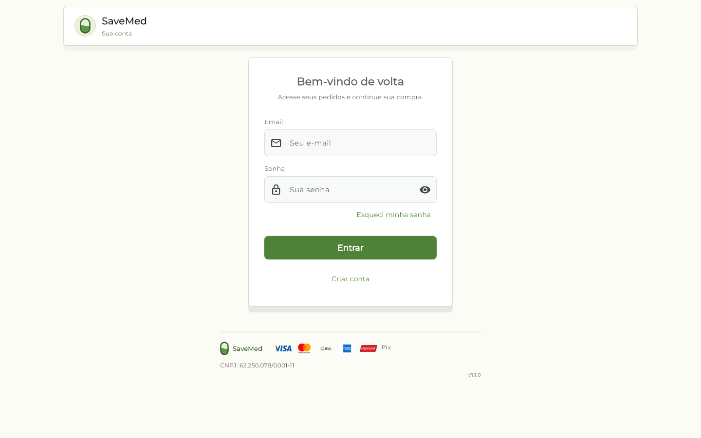
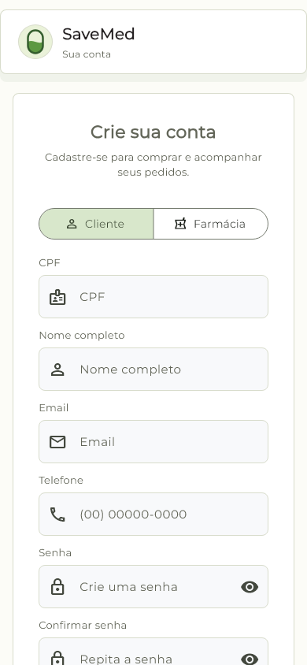
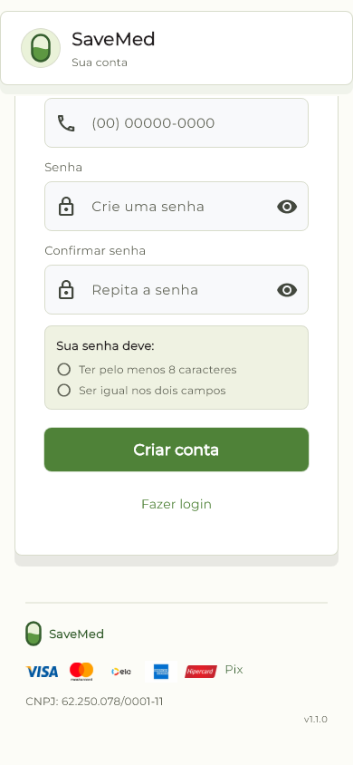
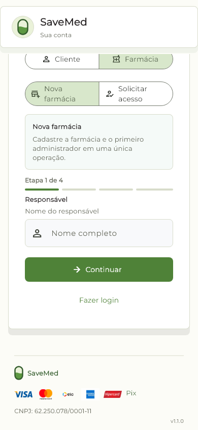

# Browser QA - 2026-09-28

## Setup

- Flutter web release build, served locally under `/savemed/`.
- Chrome 153 headless with DevTools Protocol device metrics (DPR 1) at 1440 x 900, 390 x 844, and 320 x 640 CSS pixels.
- A follow-up pass used 320 x 640 CSS pixels for the first new-pharmacy step.
- No user session was loaded, no form was submitted, and no production data was changed.

## Checked

- Login screen at 390 px: the header, login form, and footer fit without horizontal overflow.
- Customer registration: password requirements, confirmation, submit action, and return-to-login are reachable by vertical scrolling.
- New pharmacy registration: the first of four steps is readable and its continue action is visible.
- Existing pharmacy access: the search action, responsible person's fields, and request action are reachable without asking for a password.
- Browser-reported document width stayed at 390 px in all checked states.
- The current bundle was recaptured with explicit DevTools mobile metrics at 390 x 844 CSS pixels. Login and initial customer registration both reported `innerWidth=390` and `documentWidth=390`; the form extends vertically as intended.
- The current-build captures were taken without a session or form submission.
- A separate current-build pass at 320 x 640 CSS pixels checked the login and initial customer-registration screens. Both stayed within `documentWidth=320`; registration content continues below the fold with vertical scrolling, as expected.
- The current 320 px captures were taken without a session or form submission.
- At 320 px, the new-pharmacy step exposed a truncated placeholder (`Nome do responsáv...`). The redundant hint was shortened to `Nome completo`; the rebuilt screen now shows it fully, with the role still clear in the field label.

Current bundle recapture at 05:21 local time: login at desktop 1440 x 900 and
mobile 390 x 844 / 320 x 640; customer registration at 390 x 844 and 320 x 640,
including the password requirements and submit area. CDP reports
`innerWidth` and `document.documentElement.scrollWidth` equal to each viewport:
1440, 390, and 320 CSS pixels. Registration remains vertically scrollable. The
web entrypoint includes `width=device-width, initial-scale=1.0` and keeps pinch
zoom enabled.

## Captures

- [Login](browser-qa-2026-09-28/login-390.png)
- [Customer registration and password requirements](browser-qa-2026-09-28/cadastro-cliente-senha-390.png)
- [Customer registration submit area](browser-qa-2026-09-28/cadastro-cliente-envio-390.png)
- [New pharmacy registration](browser-qa-2026-09-28/cadastro-nova-farmacia-390.png)
- [Existing pharmacy access form](browser-qa-2026-09-28/solicitar-acesso-390.png)
- [Existing pharmacy request submit area](browser-qa-2026-09-28/solicitar-acesso-envio-390.png)
- [New pharmacy form after the 320 px fix](browser-qa-2026-09-28/nova-farmacia-320.png)
- [Current login build at 390 px](browser-qa-2026-09-28/current-login-mobile-390.png)
- [Current customer registration build at 390 px](browser-qa-2026-09-28/current-register-mobile-390.png)
- [Current login build at 320 px](browser-qa-2026-09-28/current-login-mobile-320.png)
- [Current customer registration build at 320 px](browser-qa-2026-09-28/current-register-mobile-320.png)
- [Current customer registration requirements and submit area at 390 px](browser-qa-2026-09-28/current-register-submit-390.png)

## Evidence freshness

The `current-*` screenshots were regenerated at 05:21 local time against the
release bundle (`main.dart.js` at 05:05 and `index.html` at 05:19 on 28/09/2026).
An initial capture using only the headless window size gave a misleading crop;
the current captures use explicit CDP device metrics and were checked visually.
Older screenshots in this folder remain historical evidence but do not represent
the latest entrypoint HTML.

After this capture set, the account-switch action was deduplicated on login and
registration. The 28/09 follow-up passed widget coverage, static analysis, Web
release build, and Android debug build. The screenshots above predate that UI
copy/action change and are not visual evidence for the current authentication
bundle. Current Flutter-rendered visual baselines are available below; a fresh
browser screenshot pass remains part of the release check.

## Current Flutter visual baselines

These are widget-rendered goldens from the current source, not browser captures.
They verify the login at mobile/desktop widths and customer/new-pharmacy signup
at 390 px. The signup capture also caught and verified the shorter password
confirmation hint.

- Login, 390 px: 
- Login, 1440 px: 
- Customer signup, 390 px: 
- Customer password requirements and submit, 390 px: 
- New pharmacy signup, 390 px: 

## Not covered

This is a viewport/emulation check, not a physical Android device. It does not verify real login, pharmacy search results, form submission, API persistence, keyboard/IME behavior, screen readers, iOS/Safari, or other browsers. Those roadmap items remain open.

## Keyboard and accessibility spot check

On 2026-09-28, Chrome DevTools Protocol was used against the local release build.
After enabling Flutter Web semantics, the accessibility tree exposed named
controls for email, password, password visibility, password recovery, login,
and account creation. Repeated Tab key events moved focus through the login
screen's actionable controls. This spot check did not submit a form and did not
test a real screen reader, mobile keyboard/IME, the complete signup flow, the
admin manager, or other browsers; those checks remain open.
